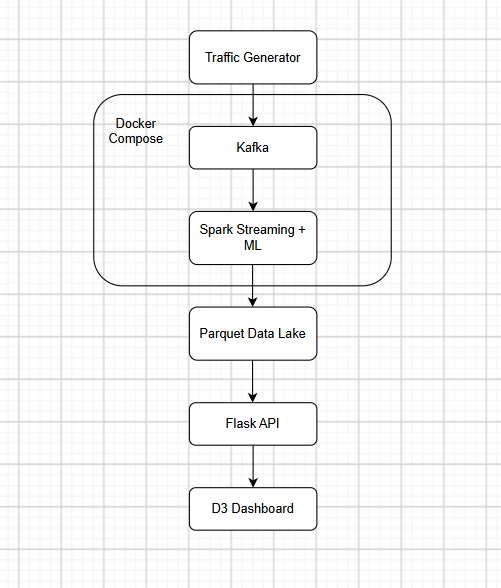
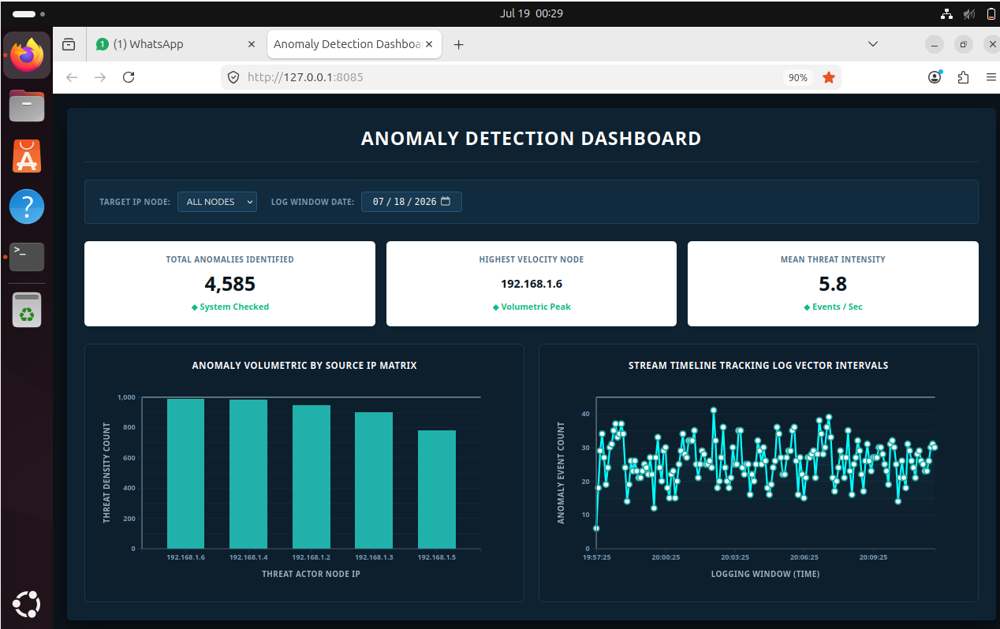

# Real-Time Cyber Threat Detection Pipeline

Real-time anomaly detection pipeline using Kafka, Spark Structured Streaming, and Isolation Forest, with a live D3.js dashboard. Built on simulated network traffic.

## What this does

A generator script simulates network traffic and pushes it to Kafka. Spark Structured Streaming reads the stream, groups events into sliding time windows, and runs each window through an Isolation Forest model to flag anomalies. Flagged results get written to a Parquet data lake. A Flask API reads that data and a D3.js dashboard displays it, refreshing every few seconds.

## Architecture

1. generator.py — simulates network traffic and sends it to a Kafka topic
2. Kafka — message broker for the incoming event stream
3. stream_processor.py — Spark job that windows the data and applies the ML model
4. Parquet data lake — stores the flagged anomaly windows
5. app.py — Flask API that reads the data lake and serves it as JSON
6. templates/index.html — D3.js dashboard that polls the API and renders charts and alerts

Kafka and Spark run through Docker Compose.

## Dashboard

## Setup

Requirements: Docker, Python 3.9+, pip

docker-compose up -d
pip install -r requirements.txt

## Running it

Start these in separate terminals:

1.python generator.py 

Sends simulated traffic to Kafka

2.python stream_processor.py 

Reads from Kafka, scores anomalies, writes to Parquet

3.python app.py 

Serves the dashboard at localhost:8085

Open `http://localhost:8085` in a browser.

## Files

- train_model.py — trains the Isolation Forest model on synthetic data and saves it
- export_for_d3.py — one-off script to export Parquet data to JSON
- read_parquet.py — utility to inspect the data lake contents
- docker-compose.yml — defines Zookeeper, Kafka, Spark master, and Spark worker

